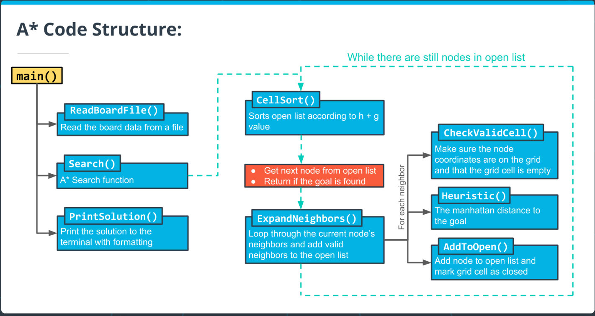

### Introduction

`A*` search is an efficient path mapping search algorithm for a graphical algorithms.
This section will start with a guide into algorithms and introduce the programming 
aspects throughout.

#### Motion Planning

The fundamental problem with motion planning is that you are given the following:
1. Map
2. Starting Location
3. Goal Location
4. Cost 

With the goal of finding the minimum cost path.

#### Basics of AStar

imagine a `5*5` grid in which you start in the upper left quadrant. You expand from 
`[0,0]` -> `[0,1]` and `[1,0]`. These new nodes all have a "cost" of 1 (g). You than 
expand from each of these new nodes to all the surrounding nodes. ie:
- `[0,1]` -> `[[0,2],[1,1]]`
- `[1,0]` -> `[[2,0],[1,1]]` 

with each node `[[0,2],[1,1],[2,0]]` (notice how 1,1 overlapped) costing 2 (g).
Each "tree" would expand (given whatever restrictions) until the smallest cost path was found.

This algorithm described by Sebastian is very similar to other search algorithms 
you may have seen before, such as [breadth-first search](https://en.wikipedia.org/wiki/Breadth-first_search),
except for the additional step of computing a heuristic and using that heuristic (in addition 
to the cost) to find the next node.

#### AStar Psuedocode
**Search**( grid, initial_point, goal_point ) :

1. Initialize an empty list of open nodes.

2. Initialize a starting node with the following:

    - x and y values given by initial_point.
    - g = 0, where g is the cost for each move.
    - h given by the heuristic function (a function of the current coordinates and the goal).
3. Add the new node to the list of open nodes.

4. while the list of open nodes is nonempty:

    1. Sort the open list by f-value
    2. Pop the optimal cell (called the current cell).
    3. Mark the cell's coordinates in the grid as part of the path.
    4. if the current cell is the goal cell:

        - return the grid.
    5. else, expand the search to the current node's neighbors. This includes the following steps:

        - Check each neighbor cell in the grid to ensure that the cell is empty: it hasn't been closed and is not an obstacle.
        - If the cell is empty, compute the cost (g value) and the heuristic, and add to the list of open nodes.
        - Mark the cell as closed.
5. If you exit the while loop because the list of open nodes is empty, you have run out of new nodes to explore and haven't found a path.

**A Star Summary**:
algorithm finds a path from the start node to the end node by checking for 
open neighbors of the current node, computing a heuristic for each of the 
neighbors, and adding those neighbors to the list of open nodes to explore 
next. The next node to explore is the one with the lowest total cost + 
heuristic (g + h). This process is repeated until the end is found, as long as
there are still open nodes to explore.

We will be using the following code structue to build the `A*` path finding algorithm:

The code for the `A*` search algorithm has been broken down into the following 
functions:

- CellSort() - sorts the open list according to the sum of h + g
- ExpandNeighbors() - loops through the current node's neighbors and calls appropriate functions to add neighbors to the open list
- CheckValidCell() - ensures that the potential neighbor coordinates are on the grid and that the cell is open
- Heuristic() - computes the distance to the goal
- AddToOpen() - adds the node to the open list and marks the grid cell as closed

You will be implementing these functions along with a few other small helper 
functions throughout the rest of this lesson to complete the ASCII `A*`
search program.
