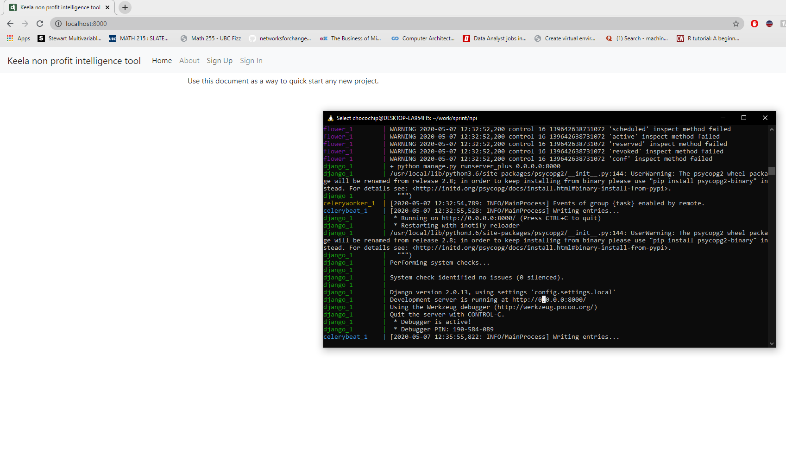

### Intro

We will learn about several key concepts for writing larger projects:
- Header Files:
    - Using headers to break a single file into multiple files
- Build Systems:
    - CMake and Make
- Tools for writing Larger Programs:
    - References
    - Pointers
    - Maps
    - Classes and Object-Oriented Programming in C++

#### Header Files
Header files, or .h files, allow related function, method, and class
declarations to be collected in one place. The corresponding definitions can 
then be placed in .cpp files. The compiler considers a header declaration a 
"promise" that the definition will be found later in the code, so if the 
compiler reaches a function that hasn't been defined yet, it can continue on 
compiling until the definition is found. This allows functions to be defined 
(and declared) in arbitrary order.

One other way to solve the code problem above (without rearranging the 
functions) would have been to declare each function at the top of the file. 
A function declaration is much like the first line of a function definition - 
it contains the return type, function name, and input variable types. The 
details of the function definition are not needed for the declaration though.

To avoid a single file from becomming cluttered with declarations and 
definitions for every function, it is customary to declare the functions in 
another file, called the header file. In C++, the header file will have 
filetype `.h`, and the contents of the header file must be included at the 
top of the `.cpp` file. See the following example for a refactoring of the 
code above into a header and a cpp file.

```cpp
// The header file with just the function declarations.
// When you click the "Run Code" button, this file will
// be saved as header_example.h.
#ifndef HEADER_EXAMPLE_H
#define HEADER_EXAMPLE_H

void OuterFunction(int);
void InnerFunction(int);

#endif
```

```cpp
// The contents of header_example.h are included in 
// the corresponding .cpp file using quotes:
#ing pointers with functions, some care should be taken. If a pointer is passed to a function and then assigned to a variable in the function that goes out of scope after the function finishes executing, then the pointer will have undefined behavior at that point - the memory it is pointing to might be overwritten by other parts of the program.nclude "header_example.h"

#include <iostream>
using std::cout;

void OuterFunction(int i) 
{
        InnerFunction(i);
}

void InnerFunction(int i) 
{
        cout << "The value of the integer is: " << i << "\n";
}

int main() 
{
        int a = 5;
            OuterFunction(a);
}
```

Notice that the code from the first example was fixed without having to rearrange the functions! In the code above, you might also have noticed several other things:
- The function declarations in the header file don't need variable names, just variable types. You can put names in the declaration, however, and doing this often makes the code easier to read.
- The `#include` statement for the header used quotes `" "` around the file name, and not angle brackets `<>`. We have stored the header in the same directory as the `.cpp` file, and the quotes tell the preprocessor to look for the file in the same directory as the current file - not in the usual set of directories where libraries are typically stored.
- Finally, there is a preprocessor directive:
    ```cpp
        #ifndef HEADER_EXAMPLE_H
        #define HEADER_EXAMPLE_H
    ``` 
    
at the top of the header, along with an `#endif` at the end. This is called an 
"include guard". Since the header will be included into another file, and 
`#include` just pastes contents into a file, the include guard prevents the 
same file from being pasted multiple times into another file. This might 
happen if multiple files include the same header, and then are all included 
into the same `main.cpp`, for example. 
The `ifndef` checks if `HEADER_EXAMPLE_H` has not been defined in the file 
already. If it has not been defined yet, then it is defined with 
`#define HEADER_EXAMPLE_H`, and the rest of the header is used. If 
`HEADER_EXAMPLE_H` has already been defined, then the preprocessor does not 
enter the `ifndef` block.
**Note:** There are other ways to do this. Another common way is to use an 
`#pragma once`preprocessor directive, but we won't cover that in detail here. 
See [this Wikipedia article](https://en.wikipedia.org/wiki/Include_guard) for 
examples.

Running `main2.cpp`:
```bash
c17 main2.cpp increment_and_sum.cpp vect_add_one.cpp
```


if you look carefully at the files above, you will see several things:
- `vect_add_one.h` is included in `increment_and_sum.cpp`.

>This is because `AddOneToEach` is used in `IncrementAndComputeVectorSum`.
Including the `vect_add_one.h` header means that the `AddOneToEach` function 
declaration is pasted into `increment_and_sum.cpp`, so no compiler error will 
occur when the `AddOneToEach` function is used.
    
- Only the header file needs to be included in another file. 

>As long as the header file is included, the corresponding function declarations 
will be included. When the compiler finds an undefined function, it has already 
seen the function's declaration. This means the compiler can continue on without 
error until it finds the definition of the function, regardless of where that 
definition is.
        
- Some libraries, like `<vector>` are included in multiple files.

>Each file is compiled alone and must have all the declarations and libraries 
necessary to compile, so the necessary libraries must be included. This is 
another reason why 
[include guards](https://github.com/isocpp/CppCoreGuidelines/blob/master/CppCoreGuidelines.md#Rs-guards) 
are important - if multiple headers were included in `main`, each with the 
same `#includ <vector>` statement, you wouldn't want the `vector` header 
pasted multiple times into the code.

- The `g++` compile command from the "Run Code" button is:

```bash
g++ -std=c++17 ./code/main.cpp ./code/increment_and_sum.cpp ./code/vect_add_one.cpp && ./a.out
```

>When compiling, each of the relevant `.cpp` files must be included in the 
compile command. The `-std=c++17` specifies that we are using the C++ 17 standard 
(which happens automatically in the terminal).

### CMake and Make

In the previous notebook, you saw how example code could be split into 
multiple .h and .cpp files, and you used g++ to build all of the files 
together. For small projects with a handful of files, this works well. But what 
would happen if there were hundreds, or even thousands, of files in the project? 
You could type the names of the files at the command line each time, but there 
tools to make this easier.

Many larger C++ projects use a [build system](https://en.wikipedia.org/wiki/List_of_build_automation_software) 
to manage all the files during the build process. The build system allows for 
large projects to be compiled with a few commands, and build systems are able 
to do this in an efficient way by only recompiling files that have been changed.

#### Object Files

When you compile a project with g++, g++ actually performs several distinct tasks:
1. The preprocessor runs and executes any statement beginning with a hash 
symbol: `#`, such as `#includ` statements. This ensures all code is in the 
correct location and ready to compile.
2. Each file in the source code is compiled into an "object file" (a .o file). 
Object files are platform-specific machine code that will be used to create an executable.
3. The object files are "linked" together to make a single executable. In the 
examples you have seen so far, this executable is `a.out`, but you can specify 
whatever name you want.

It is possible to have `g++` perform each of the steps separately by using the 
`-c` flag. For example,
```bash
g++ -c main.cpp
```
will produce a `main.o` file, and that file can be converted to an executable 
with 
```bash
g++ main.o
```

##### Compiling One File of Many, Step 1
In the previous example, you compiled a single source code file to an object 
file, and that object file was then converted into an executable.

Now you are going to try the same process with multiple files. Navigate to the 
`multiple_files_example` directory in the terminal to the right. 
This directory should have the `increment_and_sum` and `vect_add_one` 
files from a previous Notebook. Try compiling with the commands below:

```bash 
root@abc123defg:/home/workspace/multiple_files_example# g++ -c *.cpp
root@abc123defg:/home/workspace/multiple_files_example# g++ *.o
root@abc123defg:/home/workspace/multiple_files_example# ./a.out
```
Here, the `*` operator is a wildcard, so any matching file is selected. If you 
compile and run these files together, the executable should print:
>The total is: 14


##### Compiling One File of Many, Step 2

But what if you make changes to your code and you need to re-compile? In that 
case, you can compile only the file that you changed, and you can use the 
existing object files from the unchanged source files for linking.

Try changing the code in `/multiple_files_example/main.cpp` to have different 
numbers in the vector and save the file with `CTRL-s`.

When you have done that, re-compile just `main.cpp` by running:

```bash
root@abc123defg:/home/workspace/multiple_files_example# g++ -c main.cpp
root@abc123defg:/home/workspace/multiple_files_example# g++ *.o
root@abc123defg:/home/workspace/multiple_files_example# ./a.out
```

Compiling just the file you have changed saves time if there are many files 
and compilation takes a long time. However, the process above is tedious when 
using many files, especially if you don't remember which ones you have modified.

For larger projects, it is helpful to use a build system which can compile 
exactly the right files for you and take care of linking.

On the next page, we'll introduce a cross-platform build system that you'll 
be using in several of the projects in this Nanodegree program.

##### CMake and Make

CMake is an open-source, platform-independent build system. CMake uses text 
documents, denoted as `CMakeLists.txt` files, to manage build environments, 
like [make](https://en.wikipedia.org/wiki/Make_(software)).
A comprehensive tutorial on CMake would require an entire course, but you can 
learn the basics of CMake here, so you'll be ready to use it in the upcoming 
projects.

##### CMakeLists.txt

`CMakeLists.txt` files are simple text configuration files that tell CMake how 
to build your project. There can be multiple `CMakeLists.txt` files in a project.
In fact, One `CMakeList.txt` file can be included in each directory of the project,
indicating how the files in that directory should be built.

These files can be used to specify the locations of necessary packages, set build
flags and environment variables, specify target names and locations and other actions.

In the next few pages of this workspace you are going to create a basic 
`CMakeLists.txt` file to build a small project. 

If you have trouble with any of these steps, see the file `SolutionCMakeLists.txt`
in the tab on the right. 


The first lines that you'll want in your `CMakeLists.txt` are lines that specifies the 
minimum versions of cmake and `C++` required to build the project. Add the following 
lines to your `CMakeLists.txt` and save the file:

```bash 
cmake_minimum_required(VERSION 3.5.1)

set(CMAKE_CXX_STANDARD 14)
```
These lines set the minimum cmake version required to 3.5.1 and set the 
environment variable `CMAKE_CXX_STANDARD` so CMake uses C++ 14. On your own 
computer, if you have a recent `g++` compiler, you could use C++ 17 instead.

##### CMake Step 2
CMake requires that we name the project, so you should choose a name for the 
project and then add the following line to `CMakeLists.txt`:

```bash 
project(<your_project_name>)
```
You can choose any name you want, but be sure to change `<your_project_name>`
to the actual name of the project!

##### CMake Step 3
Next, we want to add an executable to this project. You can do that with the 
`add_executable` command by specifying the executable name, along with the 
locations of all the source files that you will need. CMake has the ability to 
automatically find source files in a directory, but for now, you can just specify each file needed:

```bash 
add_executable(your_executable_name  path_to_file_1  path_to_file_2 ...)
```
Hint: The source files you need are the *three* .cpp files in the `src/` 
directory. You can specify the path relative to the `CMakeLists.txt` file, so 
`src/main.cpp` would work, for example.


##### CMake Step 4

A typical CMake project will have a `build` directory in the same place as the 
top-level `CMakeLists.txt`. Make a build directory in the 
`/home/workspace/cmake_example` folder:

```bash
root@abc123defg:/home/workspace/cmake_example# mkdir build
root@abc123defg:/home/workspace/cmake_example# cd build
```

From within the build directory, you can now run CMake as follows:

```bash 
root@abc123defg:/home/workspace/cmake_example/build# cmake ..
root@abc123defg:/home/workspace/cmake_example/build# make
```

The first line directs the `cmake` command at the top-level `CMakeLists.txt` 
file with `..`. This command uses the `CMakeLists.txt` to configure the project 
and create a `Makefile` in the build directory.

In the second line, `make` finds the `Makefile` and uses the instructions in
the `Makefile` to build the project.

##### CMake Step 5

If everything has worked correctly, you should now be able to run your 
executable from the build folder:

```bash
root@abc123defg:/home/workspace/cmake_example/build# ./your_executable_name
```
This executable should print:

>The total is: 14

just as it did in the previous workspace.

If you dont remember the name of your executable, the last line of the `make`
output should tell you:
```bash
[100%] Built target <your_executable_name>
```

##### CMake Step 6
Now that your project builds correctly, try modifying one of the files. 
When you are ready to run the project again, you'll only need to run the `make` 
command from the build folder, and only that file will be compiled again. 
Try it now!

In general, CMake only needs to be run once for a project, unless you are 
changing build options (e.g. using different build flags or changing where 
you store your files).

`Make` will be able to keep track of which files have changed and compile only 
those that need to be compiled before building.

**Note**: If you do re-run CMake, or if you are having problems with your build, 
*it can be helpful to delete your build directory and start from scratch. 
Otherwise, some environment variables may not be reset correctly.*


#### References
As mentioned previously, a reference is another name given to an existing 
variable. On the left hand side of any variable declaration, the `&` 
operator can be used to declare a reference. 

```cpp
#include <iostream>
using std::cout;

int main() 
{
  int i = 1;
            
  // Declare a reference to i.
  int& j = i;
  cout << "The value of j is: " << j << "\n";
  
 // Change the value of i.
 i = 5;
 cout << "The value of i is changed to: " << i << "\n";
 cout << "The value of j is now: " << j << "\n";
 
  // Change the value of the reference.
  // Since reference is just another name for the variable,
  // th
  j = 7;
  cout << "The value of j is now: " << j << "\n";
  cout << "The value of i is changed to: " << i << "\n";
}
```

### Pointers

Pointers have traditionally been a stumbling block for many students 
learning C++, but they do not need to be!

>A C++ pointer is just a variable that stores the memory address of an object 
in your program.

That is the most important thing to understand and remember about pointers - 
they essentially keep track of *where* a variable is stored in the computer's memory.

in the previous lessons, you implemented `A*` search in a single file without 
using C++ pointers, except in `CellSort` code that was provided for you; a C++ 
program can be written without using pointers extensively (or at all). 
However, pointers give you better control over how your program uses memory. 
However, much like the pass-by-reference example that you saw previously, it 
can often be far more efficient to perform an operation with a pointer to an 
object than performing the same operation using the object itself.


Pointers are an extremely important part of the C++ language, and as you are 
exposed to more C++ code, you will certainly encounter them. 
In this notebook, you will become familiar with basic pointers so you get 
comfortable with the syntax, and you will be ready to use them in the 
course project code.

#### Accessing a Memory Address

Each variable in a program stores its contents in the computer's memory, and 
each chunk of the memory has an address number. For a given variable, 
the memory address can be accessed using an ampersand in front of the variable. 
To see an example of this, execute the following code which displays the 
[hexadecimal](https://en.wikipedia.org/wiki/Hexadecimal) memory addresses of 
the variables `i` and `j`:
```cpp
#include <iostream>
using std::cout;

int main() {
  int i = 5;
  int j = 6;
  
  // Print the memory addresses of i and j
  cout << "The address of i is: " << &i << "\n";
  cout << "The address of j is: " << &j << "\n";
}
```

At this point, you might be wondering why the same symbol `&` can be used to 
both access memory addresses and, as you've seen before, pass references into 
a function. This is a great thing to wonder about. The overloading of the 
ampersand symbol `&` and the `*` symbol probably contribute to much of the 
confusion around pointers.

> **The symbols `&` and `*` have a different meaning, depending on which side 
of an equation they appear.**

_This is extremely important to remember._ For the `&` symbol, if it appears 
on the left side of an equation (e.g. when declaring a variable), it means 
that the variable is declared as a reference. If the `&` appears on the right 
side of an equation, or before a previously defined variable, it is used to 
return a memory address, as in the example above.

Try using the cell above to create new variables and print out their addresses! 

#### Storing a Memory Address (int type)

Once a memory address is accessed, you can store it using a pointer. A pointer 
can be declared by using the `*` operator in the declaration. See the 
following code for an example:
```cpp
#include <iostream>
using std::cout;

int main() 
{
  int i = 5;
  // A pointer pointer_to_i is declared and initialized to the address of i.
  int* pointer_to_i = &i;
                    
  // Print the memory addresses of i and j
  cout << "The address of i is:          " << &i << "\n";
  cout << "The variable pointer_to_i is: " << pointer_to_i << "\n";
}
```

As you can see from the code, the variable `pointer_to_i` is declared as a 
pointer to an `int` using the `*` symbol, and `pointer_to_i` is set to the 
address of `i`. From the printout, it can be seen that `pointer_to_i` holds 
the same value as the address of `i`.


#### Getting an Object Back from a Pointer Address

Once you have a pointer, you may want to retrieve the object it is pointing to. 
In this case, the `*` symbol can be used again. This time, however, it will 
appear on the right hand side of an equation or in front of an already-defined 
variable, so the meaning is different. In this case, it is called the "dereferencing 
operator", and it returns the object being pointed to. You can see how this works 
with the code below:

```cpp
#include <iostream>
using std::cout;

int main() 
{
  int i = 5;
  // A pointer pointer_to_i is declared and initialized to the address of i.
  int* pointer_to_i = &i;
                    
  // Print the memory addresses of i and j
  cout << "The address of i is:          " << &i << "\n";
  cout << "The variable pointer_to_i is: " << pointer_to_i << "\n";
  cout << "The value of the variable pointed to by pointer_to_i is: " << *pointer_to_i << "\n";
}
```
In the following example, the code is similar to above, except that the object 
that is being pointed to is changed before the pointer is dereferenced. 
Before executing the following code, guess what you think will happen to the 
value of the dereferenced pointer.

```cpp
#include <iostream>
using std::cout;

int main() {
  int i = 5;
  // A pointer pointer_to_i is declared and initialized to the address of i.
  int* pointer_to_i = &i;
                    
  // Print the memory addresses of i and j
  cout << "The address of i is:          " << &i << "\n";
  cout << "The variable pointer_to_i is: " << pointer_to_i << "\n";
                                    
  // The value of i is changed.
  i = 7;
  cout << "The new value of the variable i is                     : " << i << "\n";
  cout << "The value of the variable pointed to by pointer_to_i is: " << *pointer_to_i << "\n";
}
```


### Pointers to Other Object Types

Although the type of object being pointed to must be included in a pointer 
declaration, pointers hold the same kind of value for every type of object: 
just a memory address to where the object is stored. In the following code, 
a vector is declared. Write your own code to create a pointer to the address 
of that vector. Then, dereference your pointer and print the value of the 
first item in the vector.

```cpp
#include <iostream>
#include <vector>
using std::cout;
using std::vector;

int main() {
   // Vector v is declared and initialized to {1, 2, 3}
   vector<int> v {1, 2, 3};
                
   // Declare and initialize a pointer to the address of v here:
   vector<int> *point_to_v = &v; 
   // The following loops over each int a in the vector v and prints.
   // Note that this uses a "range-based" for loop:
   // https://github.com/isocpp/CppCoreGuidelines/blob/master/CppCoreGuidelines.md#Res-for-range
   for (int a: v) {
   cout << a << "\n";
   }
   cout<<"Pointer location: " <<point_to_v<<"\n";
   cout<<"value at pointer: " <<(*point_to_v)[0]<<"\n";
   // Dereference your pointer to v and print the int at index 0 here (note: you should print 1):
}
```

#### Passing Pointers to a Function

Pointers can be used in another form of pass-by-reference when working with 
functions. When used in this context, they work much like the references that 
you used for pass-by reference previously. If the pointer is pointing to a large
object, it can be much more efficient to pass the pointer to a function than 
to pass a copy of the object as with pass-by-value.

In the following code, a pointer to an int is created, and that pointer is passed 
to a function. The object pointed to is then modified in the function.

```cpp
#include <iostream>
using std::cout;

void AddOne(int* j)
{
   // Dereference the pointer and increment the int being pointed to.
   (*j)++;
}

int main() 
{
   int i = 1;
   cout << "The value of i is: " << i << "\n";
                
   // Declare a pointer to i:
   int* pi = &i;
   AddOne(pi);
   cout << "The value of i is now: " << i << "\n";
}
```
When using pointers with functions, some care should be taken. If a pointer is 
passed to a function and then assigned to a variable in the function that goes out
of scope after the function finishes executing, then the pointer will have undefined
behavior at that point - the memory it is pointing to might be overwritten 
by other parts of the program.


#### Returning a Pointer from a Function

You can also return a pointer from a function. As mentioned just above, if you do 
this, you must be careful that the object being pointed to doesn't go out of 
scope when the function finishes executing. If the object goes out of scope, the 
memory address being pointed to might then be used for something else.

In the example below, a reference is passed into a function and a pointer is returned.
This is safe since the pointer being returned points to a reference - a variable 
that exists outside of the function and will not go out of scope in the function.

```cpp
#include <iostream>
using std::cout;

int* AddOne(int& j) 
{
  // Increment the referenced int and return the
  // address of j.
  j++;
  return &j;
}

int main() 
{
  int i = 1;
  cout << "The value of i is: " << i << "\n";
                
  // Declare a pointer and initialize to the value
  // returned by AddOne:
  int* my_pointer = AddOne(i);
  cout << "The value of i is now: " << i << "\n";
  cout << "The value of the int pointed to by my_pointer is: " << *my_pointer << "\n";
}
```
#### References vs Pointers

Pointers and references can have similar use cases in C++. As seen previously 
both references and pointers can be used in pass-by-reference to a function. 
Additionally, they both provide an alternative way to access an existing variable: 
pointers through the variable's address, and references through another name for 
that variable. But what are the differences between the two, and when should each 
be used? The following list summarizes some of the differences between pointers and 
references, as well as when each should be used:


References are generally easier and safer than pointers. As a decent rule of 
thumb, references should be used in place of pointers when possible.

However, there are times when it is not possible to use references. One example 
is object initialization. You might like one object to store a reference to 
another object. However, if the other object is not yet available when the first 
object is created, then the first object will need to use a pointer, not a reference, 
since a reference cannot be null. The reference could only be initialized once 
the other object is created.

### Maps
So far in this course you have seen container data structures, like the 
vector and the array. Additionally, you have used classes in your code for 
this project. Container data structures are fantastic for storing ordered data, 
and classes are useful for grouping related data and functions together, but 
neither of these data structures is optimal for storing associated data.

#### Dictionary Example

A map (alternatively [hash table](https://en.wikipedia.org/wiki/Hash_table), 
hash map, or dictionary) is a data structure that uses key/value pairs to store 
data, and provides efficient lookup and insertion of the data. The name 
"dictionary" should provide an excellent idea of how these work, since a dictionary 
is a real life example of a map. Here is a slightly edited entry from 
[www.dictionary.com](https://www.dictionary.com/browse/word?s=t) defining the word "word":

>word
- a unit of language, consisting of one or more spoken sounds or their 
written representation, that functions as a principal carrier of meaning.
- speech or talk: to express one's emotion in words.
- a short talk or conversation: "Marston, I'd like a word with you."
- an expression or utterance: a word of warning.


#### Data Representioantion
If you were to store this data in your program, you would probably want to be 
able to quickly look up the definitions using the key "word". With a map, a 
vector of definitions could be stored as the value corresponding to the "word" 
key:



In the following notebook, you will learn how to use an `unordered_map`, 
which is the C++ standard library implementation of a map. Although C++ has 
several different implementations of map data structures which are similar, 
`unordered_map` is the structure that you will use in your project.

In the cell below, we have created a hash table (`unordered_map`) to store the 
data from the example above. To create an `unordered_map` in C++, you must 
include the `<unordered_map>` header, and the sytnax for declaring an `unordered_map` is 
as follows:
```cpp
unordered_map <key_type, value_type> variable_name;
```
In the code below, we check if the `key` is in the `unordered_map` using the 
`.find()` method. If the key does not exist in the map, then `.find()` returns 
an `unordered_map::end()` type. Otherwise, `.find()` returns a 
[C++ iterator](http://www.cplusplus.com/reference/iterator/), which 
is a pointer that points to the beginning of the iterable key-value pair. 

We haven't covered iterators in this course, and you won't need them for 
this project, but they are a lot like pointers that can "iterate" forward or 
backward through a range.

```cpp
#include <iostream>
#include <vector>
#include <unordered_map>
#include <string>
using std::vector;
using std::cout;
using std::unordered_map;
using std::string;


int main() {
  // Create strings to use in the hash table.
  string key = "word";
  string def_1 = "a unit of language, consisting of one or more spoken sounds or their written representation, that functions as a principal carrier of meaning";
  string def_2 = "speech or talk: to express one's emotion in words";
  string def_3 = "a short talk or conversation: 'Marston, I'd like a word with you.'";
  string def_4 = "an expression or utterance: a word of warning";
  unordered_map <string, vector<string>> my_dictionary;
  // Check if key is in the hash table.
  if (my_dictionary.find(key) == my_dictionary.end()) {
    cout << "The key 'word' is not in the dictionary." << "\n";
    cout << "Inserting a key-value pair into the dictionary." << "\n\n";
    // Set the value for the key.
    my_dictionary[key] = vector<string> {def_1, def_2, def_3, def_4};
    }

  // The key should now be in the hash table. You can access the
  // value corresponding to the key with square brackets [].
  // Here, the value my_dictionary[key] is a vector of strings.
  // We iterate over the vector and print the strings.
  cout << key << ": \n";
  auto definitions = my_dictionary[key];
  for (string definition : definitions) {
  cout << definition << "\n";
  }
}
```

If you are taking this course, you have probably used object-oriented programming 
(OOP) previously in another language. If it's been a while since you've used OOP, 
OOP is a style of coding that collects related data (object attributes) and 
functions (object methods) together to form a single data structure, called 
an object. This allows that collection of attributes and methods to be 
used repeatedly in your program without code repetition.

In C++ the attributes and methods that make up an object are specified in a code 
class, and each object in the program is an instance of that class.

This concept is intended to provide you with the basic syntax for writing 
classes in C++. In this Foundations course, you will not need to write your 
own classes for the project, but you will be modifying existing classes in the 
code. You will be writing your own classes in the next course of this 
Nanodegree: Object-Oriented Programming.

```cpp
#include <iostream>
#include <string>
using std::string;
using std::cout;

int main() 
{
  // Variables to hold each car's color.
  string car_1_color = "green";
  string car_2_color = "red";
  string car_3_color = "blue";

  // Variables to hold each car's initial position.
  int car_1_distance = 0;
  int car_2_distance = 0;
  int car_3_distance = 0;

  // Increment car_1's position by 1.
  car_1_distance++;

  // Print out the position and color of each car.
  cout << "The distance that the " << car_1_color << " car 1 has traveled is: " << car_1_distance << "\n";
  cout << "The distance that the " << car_2_color << " car 2 has traveled is: " << car_2_distance << "\n";
  cout << "The distance that the " << car_3_color << " car 3 has traveled is: " << car_3_distance << "\n";
}
```
This works for the few cars that are defined in the program, but if you wanted 
the program to keep track of many cars this would be cumbersome. You would need 
to create a new variables for every car, and the code would quickly become 
cluttered. One way to fix this would be to define a Car class with those 
variables as attributes, along with a few class methods to 
increment the distance traveled and print out car data.

```cpp
#include <iostream>
#include <string>
using std::string;
using std::cout;

// The Car class
class Car {
      public:
 // Method to print data.
 void PrintCarData() 
 {
 cout << "The distance that the " << color << " car " << number << " has traveled is: " << distance << "\n";
 }
                                      
 // Method to increment the distance travelled.
 void IncrementDistance() 
 {
 distance++;
 }
                                                                      
 // Class/object attributes
 string color;
 int distance = 0;
 int number;
};

int main() 
{
 // Create class instances for each car.
 Car car_1, car_2, car_3;

 // Set each instance's color.
 car_1.color = "green";
 car_2.color = "red";
 car_3.color = "blue";

 // Set each instance's number.
 car_1.number = 1;
 car_2.number = 2;
 car_3.number = 3;

 // Increment car_1's position by 1.
 car_1.IncrementDistance();
 // Print out the position and color of each car.
 car_1.PrintCarData();
 car_2.PrintCarData();
 car_3.PrintCarData();

}
```

This looks ok, and you have reduced the number of variables in 
main, so you might see how this could be more organized going 
forward. However, there is now a lot more code than you started with, and the main 
doesn't seem much more organzied. The code above still sets the attributes for 
each car after the car has been created.

#### Adding a Constructor

The best way to fix this is to add a _constructor_ to the `Car`  class. The 
constructor allows you to instantiate new objects with the data that you want. 
In the next code cell, we have added a constructor for `Car` that allows the 
`number` and `color` to be passed in. This means that each `Car` object can be 
created with those variables.

```cpp

#include <iostream>
#include <string>
using std::string;
using std::cout;

class Car {
 public:
 void PrintCarData() 
 {
 cout << "The distance that the " << color << " car " << number << " has traveled is: " << distance << "\n";
 }

 void IncrementDistance() 
 {
 distance++;
 }
 
 // Adding a constructor here:
 Car(string c, int n) 
 {
 // Setting the class attributes with
 // The values passed into the constructor.
 color = c;
 number = n;
 }
 
 string color;
 int distance = 0;
 int number;
};

int main() 
{
  // Create class instances for each car.
  Car car_1 = Car("green", 1);
  Car car_2 = Car("red", 2);
  Car car_3 = Car("blue", 3);

  // Increment car_1's position by 1.
  car_1.IncrementDistance();

  // Print out the position and color of each car.
  car_1.PrintCarData();
  car_2.PrintCarData();
  car_3.PrintCarData();
}
```

This is now beginning to look better. The `main` is more organized than when we 
first started, although there is a little more code overall to accomodate the 
class definition. At this point, you might want to separate your class definition 
into it's own `.h` and `.cpp` files. We'll do that in the next concept!

### Inheritance
It is possible for a class to use methods and attributes from another class using 
class *inheritance*. For example, if you wanted to make a `Sedan` class with 
additional attributes or methods not found in the generic `Car` class, you 
could create a `Sedan` class that inherited from the `Car` by using the colon notation:
```cpp
class Sedan : public Car {
 // Sedan class declarations/definitions here.   
};
```
By doing this, each Sedan class instance will have access to any of the 
public methods and attributes of Car. In the code above, 
these are `IncrementDistance()` and `PrintCarData()`. You can add additional 
features to the Sedan class as well. In the example above, Car is often referred 
to as the parent class, and Sedan as the child or derived class.

A full discussion of inheritance is beyond the scope of this course, but you 
will encounter it briefly in the project code later. In the project code, 
the classes are set up to inherit from existing classes of an open source 
code project. You won't need to use inheritance otherwise, but keep in mind that 
your classes can use all of the public methods and attributes of their parent class.

### Putting the Class Definitions into Separate Files

In the previous concept, you saw how to create a `Car` classs and use a constructor. 
At the end of that concept, your code looked like this:

If you were planning to build a larger program, at this point it might be good to 
put your class definition and function declarations into a separate file. 
Just as when we discussed header files before, 
putting the class definition into a separate header helps to organize your code, 
and prevents problems with trying to use class objects before the class is defined.

There are two things to note in the code below. 

1. When the class methods are defined outside the class, the _scope resolution operator_ `::` 
must be used to indicate which class the method belongs to. For example, in 
the definition of the `PrintCarData` method you see:
  
```cpp
void Car::PrintCarData()
```
This prevents any compiler issues if there are are two classes with methods that have the same name.


2. We have changed how the constructor initializes the variables. Instead of the previous constructor:
```cpp
Car(string c, int n) {
color = c; 
number = n;
 }
 ```
 the constructor now uses an 
 [_initializer list_](https://en.cppreference.com/w/cpp/language/initializer_list):
 ```cpp
 Car(string c, int n) : color(c), number(n) {}
 ```
 Here, the class members are initialized before the body of the constructor 
 (which is now empty). Initializer lists are a quick way to initialize 
 many class attributes in the constructor. Additionally, 
 the compiler treats attributes initialized in the list slightly differently than 
 if they are initialized in the constructor body. For reasons beyond the scope 
 of this course, if a class attribute is a reference, it must be initialized using 
 an initializer list.
                                              
 3. Variables that don't need to be visible outside of the class are set 
 as `private`. This means that they can not be accessed outside of the class, 
 which [prevents them from being accidentally changed](https://github.com/isocpp/CppCoreGuidelines/blob/master/CppCoreGuidelines.md#Rc-private).

 Check out the cells below to see this code in practice. In this code, we have 
 separated the class into declarations and definitions, with declarations being in 
 the `.h` file and definitions being in `.cpp`. Note that only the `.h` file 
 needs to be included in any other file where the definitions are used.


#### car.h and car.cpp

```cpp
#ifndef CAR_H
#define CAR_H

#include <string>
using std::string;
using std::cout;

class Car {
     public:
     void PrintCarData();
     void IncrementDistance();
                  
     // Using a constructor list in the constructor:
     Car(string c, int n) : color(c), number(n) {}
                            
     // The variables do not need to be accessed outside of
     // functions from this class, so we can set them to private.
     private:
     string color;
     int distance = 0;
     int number;
};

#endif
```

```cpp
#include <iostream>
#include "car.h"

// Method definitions for the Car class.
void Car::PrintCarData() 
{
        cout << "The distance that the " << color << " car " << number << " has traveled is: " << distance << "\n";
}

void Car::IncrementDistance() 
{
        distance++;
}
```

#### car_main.cpp
```cpp

#include <iostream>
#include <string>
#include "car.h"
using std::string;
using std::cout;

int main() 
{
  // Create class instances for each car.
  Car car_1 = Car("green", 1);
  Car car_2 = Car("red", 2);
  Car car_3 = Car("blue", 3);

  // Increment car_1's position by 1.
  car_1.IncrementDistance();

  // Print out the position and color of each car.
  car_1.PrintCarData();
  car_2.PrintCarData();
  car_3.PrintCarData();

}
```

### Scaling Up

In this concept and the previous one, you took code without classes 
and converted it into an object-oriented format.

In case you aren't convinced that organizing the code using OOP saved you 
some trouble, the next cell redefines `main.cpp` to generate 100 
cars with different colors, move each, and print data about each. This would 
have been extremely difficult to do if you had to manually create 
new variables for each car! 

There is a lot going on in the code to unpack, including the `new` 
keyword and the `->` operator. The arrow operator `->` is used to simultaneously 
- dereference a pointer to an object and 
- access an attribute or method. 

For example, in the code below, `cp` is a pointer to a Car object, and the 
following two are equivalent:

```cpp
// Simultaneously dereference the pointer and 
// access IncrementDistance().
cp->IncrementDistance();

// Dereference the pointer using *, then 
// access IncrementDistance() with traditional 
// dot notation.
(*cp).IncrementDistance();
```

The `new` operator allocates memory on the "heap" for a new Car. In 
general, this memory must be manually managed (deallocated) to avoid 
memory leaks in your program. Memory management is the primary focus of one 
of the later courses in this Nanodegree program, so we won't go into greater 
depth about the difference between stack and heap in this lesson.

Click on the explanation button for a discussion of the code. 

**Note:** This `main.cpp` uses the class files defined above, so be 
sure you have run the previous example before running this one. 

```cpp
#include <iostream>
#include <string>
#include <vector>
#include "car.h"
using std::string;
using std::cout;
using std::vector;

int main() {
  // Create an empty vector of pointers to Cars 
  // and a null pointer to a car.
  vector<Car*> car_vect;
  Car* cp = nullptr;
                        
  // The vector of colors for the cars:
  vector<string> colors {"red", "blue", "green"};
  // Create 100 cars with different colors and 
  // push pointers to each of those cars into the vector.
  for (int i=0; i < 100; i++) {;
    cp = new Car(colors[i%3], i+1);
    car_vect.push_back(cp);
  }
  // Move each car forward by 1.
  for (Car* cp: car_vect) {
    cp->IncrementDistance();
  }
  // Print data about each car.
  for (Car* cp: car_vect) {
    cp->PrintCarData();
  }
}
```

#### This Pointer
When working with classes it is often helpful to be able to refer to the 
current class instance or object. For example, given the following Car 
class from a previous lesson, the IncrementDistance() method implicitly refers 
to the current Car instance's distance attribute:

```cpp
// The Car class
class Car {
    public:
 // Method to print data.
 void PrintCarData() {
    cout << "The distance that the " << color << " car " << number << " has traveled is: " << distance << "\n";
 }

 // Method to increment the distance travelled.
 void IncrementDistance() {
    distance++;
 }

 // Class/object attributes
 string color;
 int distance = 0;
 int number;
};
```

It is possible to make this explicit in C++ by using the 
this pointer, which points to the current class instance. Using this can 
sometimes be helpful to add clarity to more complicated code:
```cpp
// The Car class
class Car {
      public:
  // Method to print data.
  void PrintCarData() {
    cout << "The distance that the " << this->color << " car " << this->number << " has traveled is: " << this->distance << "\n";
  }

  // Method to increment the distance travelled.
  void IncrementDistance() {
    this->distance++;
  }

  // Class/object attributes
  string color;
  int distance = 0;
  int number;
};
```


